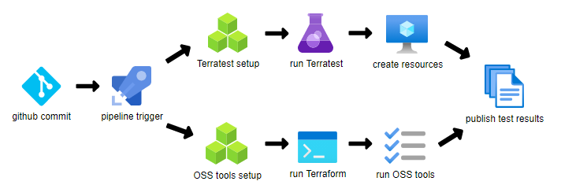

# terraform-azuredevops-reference

### Abstract

This is a reference example of a complete Azure DevOps CI cycle for Terraform using a selection of known vendor and OSS tools. This example demonstrates how to perform static analysis, integration testing, compliance testing and end-to-end testing on both Windows and Linux agents. For general background information, please see this article on the Microsoft Azure Terraform site:

https://docs.microsoft.com/en-us/azure/developer/terraform/best-practices-testing-overview

### Diagram

### Toolset

* Azure DevOps 
   * azure-pipelines.yaml and included templates, various YAML settings, secure variables, test results publishing
   * utility file downloads and Docker container usage
   * https://azure.microsoft.com/en-us/services/devops

(Windows job)
* Terraform
   * init, validate, plan, show, apply
   * https://www.terraform.io/docs/cli/commands
* Terratest 
   * terratest_log_parser, Go, Azure SDK For Go, Terratest Azure module
   * https://terratest.gruntwork.io
* Terrascan
   * security and compliance violation detection
   * https://github.com/accurics/terrascan
* TFSec
   * security scanning
   * https://github.com/tfsec/tfsec

(Linux job)
* Checkov
   * configurable static analysis for Terraform HCL
   * https://www.checkov.io
* terraform-compliance
   * simple BDD testing
   * via both local install and Docker container
   * https://terraform-compliance.com

### Prerequisites

* For the Terratest section tests, you will need to create a Azure Resource Manager (ARM) storage account and container in the desired resource group. Ensure all public access to the storage account and container is off.
<pre>
   az storage account create \
      --name YOURSTORAGEACCOUNTNAME \
      --resource-group YOURRESOURCEGROUPNAME \
      --kind StorageV2 \
      --sku Standard_LRS \
      --https-only true \
      --allow-blob-public-access false

   az storage container create \
      --name YOURSTORAGECONTAINERNAME \
      --account-name YOURSTORAGEACCOUNTNAME \
      --public-access off \
      --auth-mode login
</pre>
* Clone the repo and:

  * update tf/core/src/main.tf to the appropriate storage account values above. Use any blob key name you want.
  * update tf/core/src/variables.tf to your desired Azure region and ARM resource suffix. Do not change the resource tags (for now).

* Create a service principal with Contributor role on the above storage account YOURSTORAGEACCOUNTNAME and on the resource group YOURRESOURCEGROUPNAME. Get the client ID and client secret for that service principal.

* Create library variables in your Azure DevOps project (be sure to mark them secret) and assign them to a variable group. This example uses a variable group called "Azure-auth-vargroup" - you will need to update the YAML if you have a different name.
<pre>
   ARM_CLIENT_ID: YOURCLIENTID
   ARM_CLIENT_SECRET: YOURCLIENTSECRET
   ARM_SUBSCRIPTION_ID: YOURSUBSCRIPTIONID
   ARM_TENANT_ID: YOURTENANTID
</pre>

* For more information on the above see: https://registry.terraform.io/providers/hashicorp/azurerm/latest/docs/guides/service_principal_client_secret  

* Create a new pipeline against the cloned repo. This reference example should install easily as a Azure DevOps pipeline and pass/warn almost all of the tests. Note that the pipeline YAML files are in a subdirectory /azure-pipelines.

### Resources Created

(below assumes ARM resource suffix of "reference" was specified as var.suffix in tf/core/src/variables.tf)

| Resource Group | Resource Name | Resource Type |
|:--|:--|:--|
| rg-lzreference | salzreference | Storage Account |
| rg-lzreference | kvlzreference | Key Vault |
| rg-mgmtreference | lawsreference | Log Analytics Workspace |

The goal is to eventually build out more example resources into Management, Connectivity and Landing Zone management groups/subscriptions (with automated CI of each addition) according to:

https://docs.microsoft.com/en-us/azure/cloud-adoption-framework/ready/enterprise-scale/architecture

### Build Status

| Status | Description |
|:--|:--|
|| commit-triggered CI of Terraform core and modules |

### Helpful Links

https://blog.jcorioland.io/archives/2019/09/04/terraform-microsoft-azure-introduction.html  
https://docs.microsoft.com/en-us/azure/cloud-adoption-framework/ready/landing-zone/terraform-landing-zone  
https://docs.microsoft.com/en-us/azure/developer/go/azure-sdk-authorization  
https://julie.io/writing/terraform-on-azure-pipelines-best-practices  
https://adinermie.com/publishing-checkov-terraform-quality-checks-to-azure-devops-pipelines  
https://adinermie.com/publishing-github-super-linter-terraform-quality-checks-to-azure-devops-pipelines  
https://adinermie.com/publishing-tfsec-terraform-quality-controls-to-azure-devops-pipelines  
