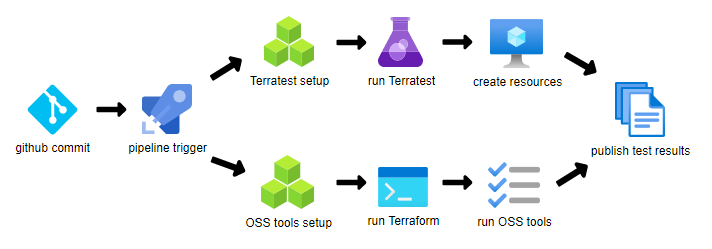

# terraform-azuredevops-reference

### Abstract

This is a reference example of a complete Azure DevOps CI cycle for Terraform using a selection of known vendor and OSS tools. This example demonstrates how to perform static analysis, integration testing, compliance testing and end-to-end testing. For background information, please see this article on the Microsoft Azure Terraform site:

https://docs.microsoft.com/en-us/azure/developer/terraform/best-practices-testing-overview

### Diagram

### Toolset

* Terraform
   * init, validate, plan, show, apply
   * https://www.terraform.io/docs/cli/commands/
* Terratest 
   * terratest_log_parser, Go, Azure SDK For Go, Terratest Azure Module
   * https://terratest.gruntwork.io/
* Checkov
   * configurable static analysis for Terraform HCL
   * https://www.checkov.io/
* terraform-compliance
   * simple BDD testing
   * via both local install and Docker container
   * https://terraform-compliance.com/
* Azure DevOps 
   * azure-pipelines.yaml, various yaml settings, test results publishing
   * https://azure.microsoft.com/en-us/services/devops

### Prerequisites

* Create a storage account and container in the desired resource group. Ensure all public access to the storage account and container is off.
<pre>
   az storage account create /\
      --name YOURSTORAGEACCOUNTNAME /\
      --resource-group YOURRESOURCEGROUPNAME /\
      --kind StorageV2 /\
      --sku Standard_LRS /\
      --https-only true /\
      --allow-blob-public-access false

   az storage container create /\
      --name YOURSTORAGECONTAINERNAME /\
      --account-name YOURSTORAGEACCOUNTNAME /\
      --public-access off /\
      --auth-mode login
</pre>
* Fork the repo and:

  * update tf/core/src/main.tf to the appropriate storage account values above. Use any blob key name you want.
  * update tf/core/src/variables.tf to your desired Azure region and ARM resource suffix. Do not change the resource tags (for now).

* Create a service principal with Contributor role on the above storage account YOURSTORAGEACCOUNTNAME and on the resource group YOURRESOURCEGROUPNAME.

* Create library variables in your Azure DevOps project (be sure to mark them secret):
<pre>
  * ARM_CLIENT_ID: yourclientid
  * ARM_CLIENT_SECRET: yourclientsecret
  * ARM_SUBSCRIPTION_ID: yoursubscriptionid
  * ARM_TENANT_ID: yourtenantid
</pre>
* Create a new pipeline against the repo. This reference example should install easily as a Azure DevOps pipeline and pass/warn all tests. Note that the pipeline YAML files are in a subdirectory /azure-pipelines.

### Resources Created

(below assumes suffix of "reference")

| Resource Group | Resource Name | Resource Type |
|:--|:--|:--|
| rg-lzreference | salzreference | Storage Account |
| rg-lzreference | kvlzreference | Key Vault |
| rg-mgmtreference | lawsreference | Log Analytics Workspace |

The goal is to eventually build out more resources into Management, Connectivity and Landing Zone management groups/subscriptions (with automated CI of each addition) according to:

https://docs.microsoft.com/en-us/azure/cloud-adoption-framework/ready/enterprise-scale/architecture

### Build Status

| Status | Description |
|:--|:--|
|| CI of Terraform core and modules |
